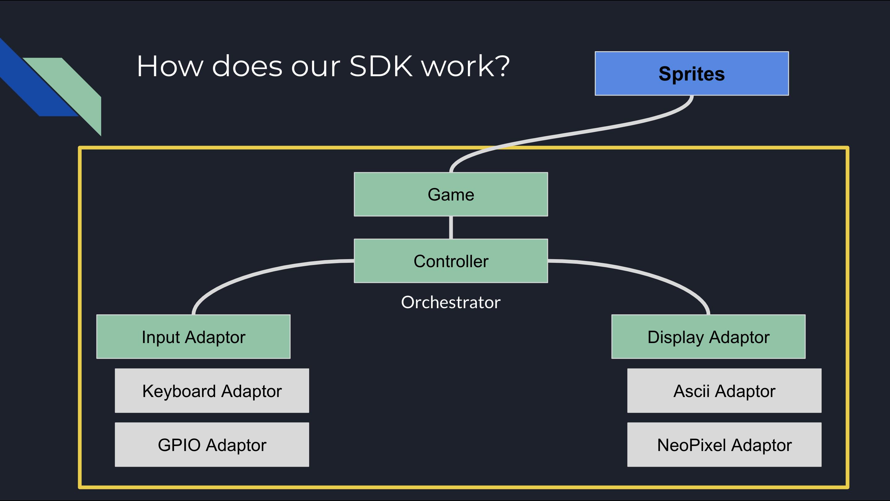

# Magik SDK

_SDK that will allow you to write a game for the [Tech Tigers](https://www.techtigers.team/home Magic Carpet game mat._
# Introduction
This was developed by the Tech Tigers FLL team as part of the Innovation Project for the 2020-2021 season -  Replay. As part of our competiton we had identify and popose an innovative solution. We chose the problem of there not being enough fun ways to stay active at home.

Our solution is the Magik Carpet - an interactive carpet that is easy to use, needs no setup, fits in with your home decor, and offers an endless variety of games and exercises for all ages.

It consists of:
- A controller: [ESP32](https://amzn.to/38eJIx1)
- The pressure sensing layer: [Velostat](https://amzn.to/3ehWQFK) and [copper tape](https://amzn.to/2OwDvWw)
- The LED layer: [LED strips](https://amzn.to/2O1q0OL)
- The cushion layer: [Interlocking, wood-patterned foamtiles](https://amzn.to/3rqJL0x)
- The facade layer: [Flex foam](https://bit.ly/38ioNcI)

For for info look [here](https://www.techtigers.team/replay/project)

# Motivation
During the pandemic, it was not safe to test our prototype with people
in person. We made an SDK so that:
- Less expirienced programmers on the team could still write games
- Teammates could write games without understanding or having acces to the hardware
- We could keep things interesting with more and more games

# Design

Our design is in the picture below

All games have an input and an output. Ours does too. The difference is that we want our games to be able to interact with different inputs and outputs. 

To do this we use adaptors. The job of these adaptors is to convert a signal from a keyboard or pressure senson into a standard input that our game can read.

It is very similar to the output, our game sets the pixels in a standard format and out output adaptors convert it into something a display can show.

### Supported Input
 - Keyboard
 - Pressure Sensor
### Supported Output
- Ascii
- LEDs on mat

# Installation

Clone 
https://github.com/techtigers-fll/replay-project

# Usage

When you clone you will see 2 main folders, magik, games

Magik is our sdk and games has games that we have written.

If you want to write a game you can.
Creat main init and a sprite.

Inside the sprite, create an update and draw function.

For examples look in the examples.
## Examples

- [demo](https://github.com/techtigers-fll/replay-project/tree/master/games/demo)
- [intro](https://github.com/techtigers-fll/replay-project/tree/master/games/intro)
- [football](https://github.com/techtigers-fll/replay-project/tree/master/games/football)
- [quadrant](https://github.com/techtigers-fll/replay-project/tree/master/games/quadrant)

